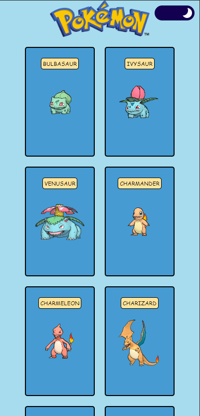
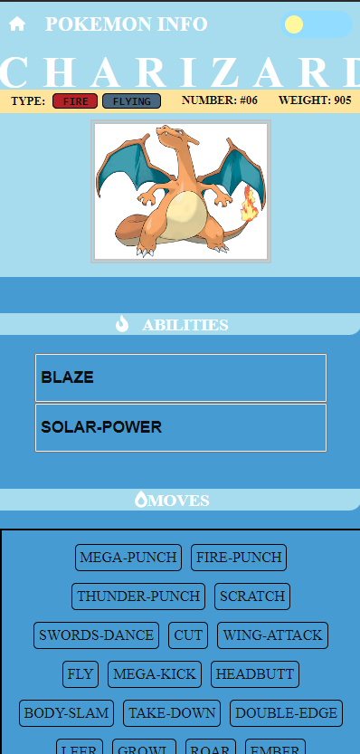

# Projeto Pokedex


Este projeto possui apenas duas páginas que podem ser acessadas pelo usuário, contendo as seguintes funcionalidades:

- A primeira página(Home) exibe uma lista completa de todos os pokémons com seus nome e um sprie animado.
- Quando um pokémon é clicado, o usuário é direcionado a sua página de informações(profile).
- A aplicação também possui um botão no canto superior direito que serve para alterar entre os temas claro e escuro.

## Design

### Mobile Design



### Feito com

<div align="center">


</div>

## Construção do projeto
Para este projeto, as principais tecnologias e ferramentas usadas foram:

- A biblioteca styled-components foi utilizada em conjunto com a font-awesome para toda a estilização de ícones e elementos do projeto visando um código limpo.
- A navegação foi feita através da biblioteca react-router-dom.
- Vite para uma criação rápida e efetiva da aplicação React.
- Axios para realizar requisições na api com o mínimo de código possível.

## Instalação

Após clonar, baixar ou fazer um fork, utilize o comando abaixo:

```shell
npm run dev
```
 Logo em seguida basta apertar a tecla "O" para abrir o projeto em seu dispositivo!